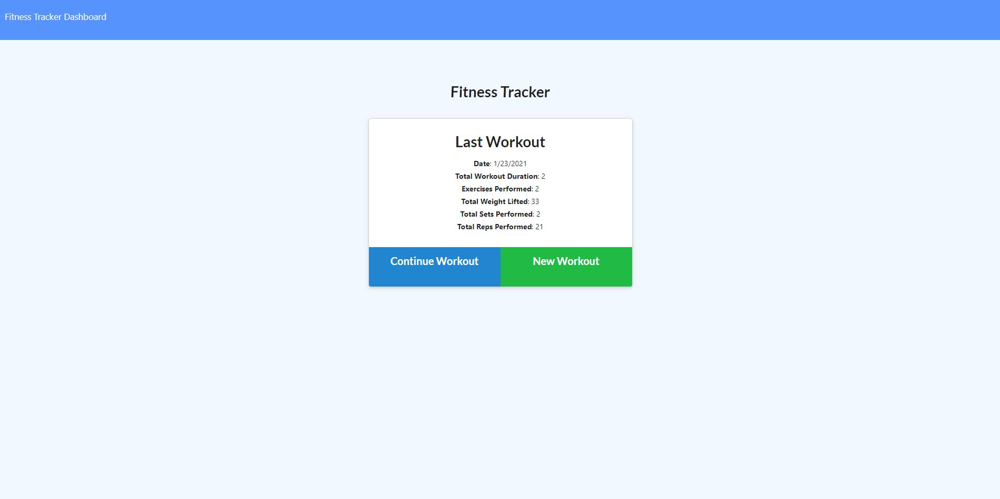
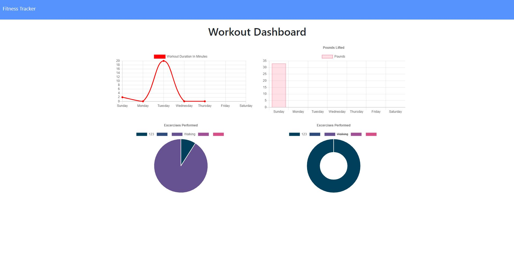

# Workout Tracker
# Table of Contents
- [Description](#Description)
- [Installations](#Installations)
- [Usage](#Usage)
- [License](#License)
- [Credits](#Credits)
- [Test](#Test)
- [Contributing](#Contributing)
# Deployed Application

https://intense-garden-42831.herokuapp.com/stats
# Description

This app already had the frontend code, I had to tweak a few things and then implement the Backend Code, I used MongoDB for the Database. This is an app where users can put in what workouts they have done, adding weight, time, type of workout, time, reps to track there progress along the way.
# Screenshots


# Installations
> npm install
# Usage
```As a user, I want to be able to view create and track daily workouts. I want to be able to log multiple exercises in a workout on a given day. I should also be able to track the name, type, weight, sets, reps, and duration of exercise. If the exercise is a cardio exercise, I should be able to track my distance traveled.```
# License
MIT
# Credits
Tony Crosby
# Test
there is no command for tests currently but in the feature it should be implemented.
# Contributing
by commiting EARLY and OFTEN